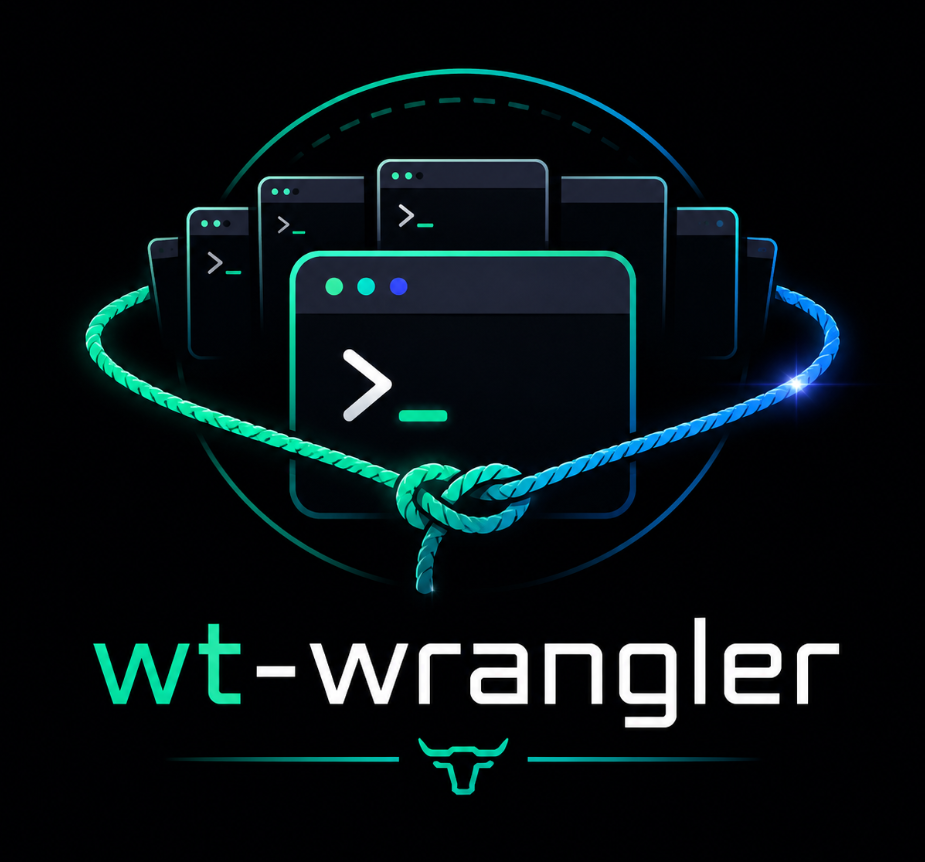

<p align="center">
  
</p>

Wrangle your [Windows Terminal](https://github.com/microsoft/terminal) tabs from a browser.

If you run agentic coding agents (Claude Code, Codex, and friends), you know the problem: every task, worktree, or background job spawns another terminal, and within an hour you've got a dozen near-identical Windows Terminal tabs and no idea which is which. `wt-wrangler` gives you one place to see them all and jump straight to the one you want.

It enumerates every tab across all open Windows Terminal windows and lets you **search** them by title, **summon** one to the foreground, or **close** it — from a dark, keyboard-friendly web UI on `localhost`. The list refreshes live, so changes you make elsewhere show up automatically.

Windows Terminal itself is never touched or modified: windows are discovered with the Win32 `EnumWindows` API and tabs are read and driven through Windows UI Automation. Windows only.

## Install

With [uv](https://docs.astral.sh/uv/):

```bash
uv tool install git+https://github.com/forensicmike/wt-wrangler
```

Then run it from anywhere (use `wtw` or the longer `wt-wrangler` — they're the same):

```bash
wtw            # start in the background and open the UI
wtw status     # is it running?
wtw stop       # stop the background server
wtw open       # just open the UI in the browser
```

`wtw` launches the server as a detached background process (no terminal stays open), waits until it's reachable, prints that it's up, and returns your prompt. It serves the UI at <http://127.0.0.1:22222>; logs go to `%LOCALAPPDATA%\wt-wrangler\server.log`. Use `wtw --foreground` to run it attached to the current terminal for debugging.

To update later: `uv tool upgrade wt-wrangler`.

## Keyboard shortcuts

| Key | Action |
| --- | --- |
| type | Filter tabs |
| ↑ / ↓ | Move selection |
| Enter | Summon selected tab |
| Delete | Close selected tab (when search is empty) |
| R | Refresh |
| ? | Show shortcuts |
| Esc | Clear search / close dialog |

Every action is also available with the mouse.

## Develop from a checkout

```bash
git clone https://github.com/forensicmike/wt-wrangler
cd wt-wrangler
uv run run.py        # dev server (no auto-reload)
```

The frontend is plain static HTML/CSS/JS (no build step). Backend is FastAPI; the Windows integration lives in `wt_wrangler/wt.py`.

## License

MIT
